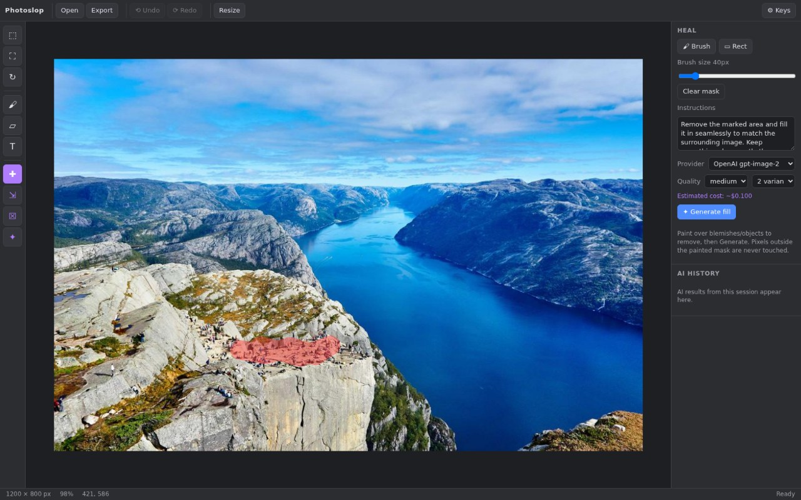

# Photoslop 2

A browser-based replacement for everyday Photoshop work: crop/rotate/straighten,
resize, format conversion, text, brush and shapes — plus AI-powered heal,
generative expand, background removal and region generation using your own
OpenAI / Gemini API keys.



**Pure static app.** No build step, no server, no dependencies to install.
Vanilla JS ES modules; Fabric.js and pica are vendored in `vendor/`.
Live at **https://photoslop2.synapticnoise.com** (also
[zeveck.github.io/photoslop2](https://zeveck.github.io/photoslop2/)).

## A Fable one-shot

This entire application was researched, planned, built, and browser-verified by
[Claude Fable 5](https://www.anthropic.com/news/claude-fable-5-mythos-5) in a
single conversation (Claude Code, July 2026) — from the prompt below through
API research, implementation, and an automated Playwright test pass, with no
human-written code. It is a sibling of [photoslop](https://github.com/zeveck/photoslop),
which explores the same idea built plan-by-plan across sub-projects.

<details>
<summary><strong>The original prompt</strong></summary>

> Our goal is make a JS/HTML app that replaces my primary usages of Photoshop.
> We can use ChatGPT imagegen (example, perhaps, in my GitHub.com/zeveck/imagegen2
> skill) and Gemini (example, perhaps, in my nanogen skill) where I need AI imagegen.
>
> My key use cases
>
> - remove a background from an image
>   - usually I use the the Object Selection Tool and then invert selection and delete
>
> - generative expand -- i.e. enlarge an image to a desired aspect ratio or size
>   beyond its bounds and generated the fill to be consistent; photoshop gives
>   options to select from, but I could just keep regenerating if needed, though
>   it'd be good to then be able to choose between the attempts easily
>
> - remove blemishes, particularly by using a brush-like interaction to "paint"
>   areas to fix and it then uses generative AI to produce the nice version,
>   with options as above
>
> - sometimes a rectangle version of above
>
> - the ability to scale / resize an image
>
> - the ability to change JPG/PNG, in particular, but other conversions would be nice
>
> - the ability to generate text-to-image in selected regions or to add a desired asset
>
> - adding text of various fonts
>
> - basic freehand painting/drawing
>
> - adding basic shapes like arrows
>
> - cropping (particularly aspect ratios) / rotating images in 90-degree
>   increments but also, ideally, with a fine slider for straitening images
>
> -----------
>
> This is probably a good started set. We'll want to research these capabilities
> as Photoshop provides them, consider how best to achieve them using
> JS/HTML/imagegens mentioned for which I can provide API keys (we'll need an
> interface for providing keys).

</details>

## Run it

```sh
python3 -m http.server 8765        # any static server works
# open http://localhost:8765
```

Deploys as-is to GitHub Pages (this repo serves its root).

## API keys

Click **⚙ Keys** and paste an OpenAI and/or Gemini API key. Keys live only in
your browser's localStorage and are sent only to the respective provider's API
(both allow direct browser calls — no proxy involved). Every AI action shows a
cost estimate before you run it, and the session's estimated spend accumulates
in the top bar. **Mock mode** (in the same dialog) fakes AI results locally for
free, which is also what the test suite uses.

## The pixel-fidelity invariant

GPT image models regenerate the *entire* image even when given a mask — the
mask is guidance, not a guarantee. Photoslop therefore never trusts an API
result wholesale:

- **Heal / generate-in-region**: a context region around your painted mask is
  sent out; the returned fill is composited back **only inside the mask**
  (feathered). Everything else stays byte-identical.
- **Generative expand**: the enlarged canvas comes back from the API, then your
  original pixels are stamped over their region (with a thin blend band at the
  seam).
- **Background removal**: the API's transparent-background output contributes
  **only its alpha channel**, which is applied to your original pixels. A
  refine brush (restore/erase) lets you fix the mask before committing.

`tests/e2e.sh` asserts this invariant with byte-equality checks.

## Tools

| Key | Tool |
|-----|------|
| V | Move / select (Del deletes) |
| C | Crop (aspect presets, thirds grid) |
| R | Rotate 90° / straighten slider (live preview, auto-crop) |
| B | Brush |
| U | Shapes: rect, ellipse, line, solid arrow |
| T | Text (web fonts; local fonts on Chromium) |
| J | Heal — paint or rect-select blemishes, AI fills |
| X | Generative expand to aspect ratio / size, with anchor |
| K | Remove background (+ refine brush) |
| G | Generate: in-region fill or standalone asset insert |

Ctrl+Z/Y undo/redo · Ctrl+O open · Ctrl+S export · Ctrl+0 fit · wheel zoom ·
space/middle-drag pan. Open images via drop, paste, or the Open button.
Export as PNG / JPEG (white-flattened) / WebP with quality control and
optional high-quality (Lanczos) resize.

AI results arrive as multiple variants — hover to preview on-canvas, click to
apply, "More options" to keep generating; everything is logged in the AI
history panel.

## Testing

```sh
python3 -m http.server 8765 &
bash tests/e2e.sh            # drives the real UI via playwright-cli, mock provider
```

## Architecture notes

- `js/document.js` — base bitmap (source of truth for pixels) + Fabric object
  layer + snapshot undo/redo.
- `js/ops/composite.js` — region extraction, API size planning
  (gpt-image-2: multiples of 16, 0.65–8.3 MP, ≤3840px edge), mask building,
  feathered composite-back. The invariant lives here.
- `js/ai/` — provider clients (OpenAI edits/generations, Gemini
  generateContent, mock), key storage, candidates picker, session history,
  spend estimates. Retries 429/5xx with backoff.
- Fabric v7 gotchas encoded in the code: object origin defaults to center
  (reset to left/top), `toCanvasElement` crops in viewport coords and ignores
  `excludeFromExport` (handled in `flatten()`).
